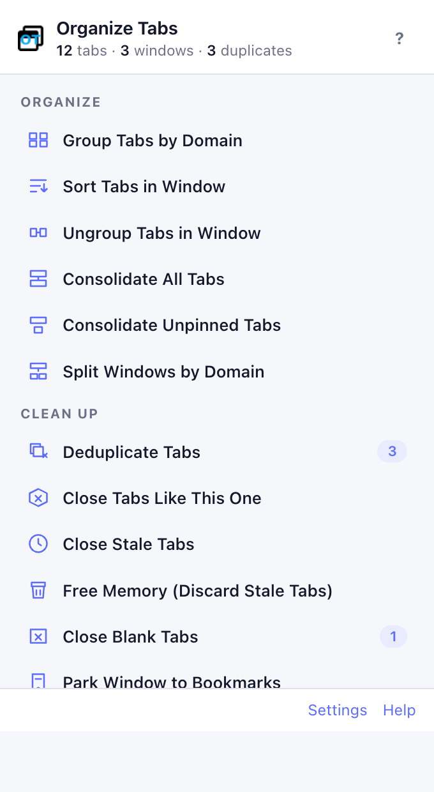
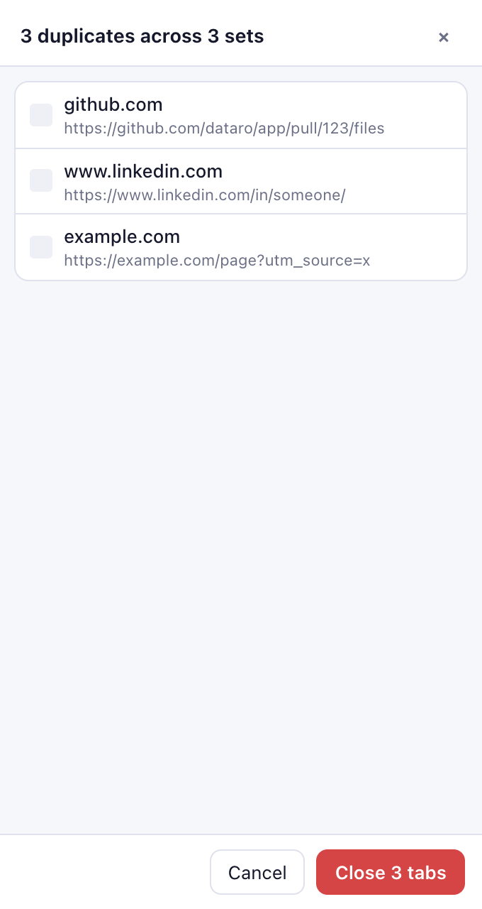
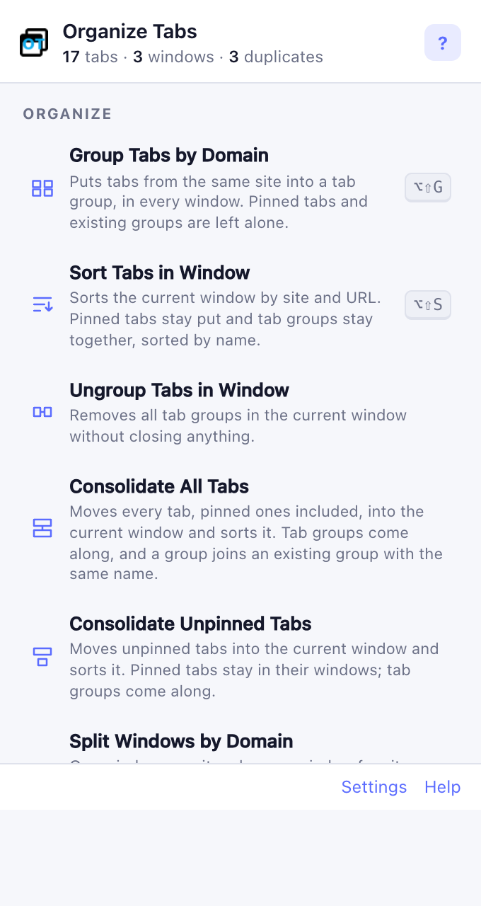

# Organize Tabs

A Chrome extension for people who keep a lot of tabs open. It groups, sorts, deduplicates and tidies tabs across every window, and it understands that a pull request, a ticket, a profile or a document is the same page even when the URL differs.

Vanilla JavaScript, no build step, no dependencies. Works in Chrome, Brave, Edge and other Chromium browsers (Chrome 121 or newer).

Chrome Web Store: <https://chrome.google.com/webstore/detail/organize-tabs/ebnlpacdgjnofakgfgbildmjdhbibnpa>

<p>
  
  
  
</p>

## Actions

Every action is available from the toolbar popup, the right-click context menu, and (optionally) a keyboard shortcut. Actions that close tabs show a preview first, and the last close can always be undone.

### Organize

| Action | What it does |
| --- | --- |
| **Group Tabs by Domain** | Puts tabs from the same site into a tab group, in every window. Pinned tabs and existing groups are left alone. |
| **Sort Tabs in Window** | Sorts the current window by site and URL. Pinned tabs stay put, tab groups stay together and are sorted by name. |
| **Ungroup Tabs in Window** | Removes all tab groups in the current window. |
| **Consolidate All Tabs** | Moves every tab, pinned ones included, into the current window and sorts it. Tab groups come along, and a group joins an existing group with the same name. |
| **Consolidate Unpinned Tabs** | Same, but pinned tabs stay in their windows. |
| **Split Windows by Domain** | One window per site, plus one window for the sites with a single tab. Tab groups are kept. The old "Collate" action. |

### Clean up

| Action | What it does |
| --- | --- |
| **Deduplicate Tabs** | Closes tabs that point at the same thing, using the duplicate rules below. Keeps the pinned, active, or most recently viewed copy. |
| **Close Tabs Like This One** | Closes tabs from the same domain, the same section of the site, or the same kind of page (all pull requests, all LinkedIn profiles). |
| **Close Stale Tabs** | Closes tabs you have not looked at for N days. Pinned, active and playing tabs are skipped. |
| **Free Memory** | Unloads stale tabs from memory without closing them. |
| **Close Blank Tabs** | Closes empty new-tab pages everywhere. |
| **Park Window to Bookmarks** | Saves the current window's tabs into a dated bookmark folder and closes them. |
| **Restore Last Parked** | Reopens the most recently parked folder as a tab group. |

### Windows

| Action | What it does |
| --- | --- |
| **Bring All Windows to Front** | Focuses and cascades every window so misplaced ones reappear. |
| **Undo Last Close** | Reopens whatever the last action closed. |

## Duplicate rules

Two URLs are duplicates when they produce the same **key**. Without a rule, the key is the URL with the scheme, `www.`, fragment, trailing slash, tracking parameters and query-parameter order normalized away. With a rule, many URLs collapse to one key:

```json
{
    "name": "GitHub pull request",
    "match": "^https?://github\\.com/([^/]+)/([^/]+)/pull/(\\d+)",
    "key": "github:$1/$2/pull/$3"
}
```

That rule makes `/pull/123`, `/pull/123/files`, `/pull/123/commits/abc` and `/pull/123#discussion_r1` the same tab. Built-in rules cover GitHub, Bitbucket, GitLab, Jira, Confluence, LinkedIn, YouTube, Google Docs and Drive, Notion, HubSpot, Slack, Figma, Amazon, Stack Overflow, Reddit and X. Add your own in Settings, where a tester shows which rule a URL hits.

The same rules power **Close Tabs Like This One**, so from any pull request you can close every open pull request with one click.

**Auto-deduplicate** (off by default) watches new tabs. When you open a link that is already open, the new tab is closed and the existing one focused.

## Settings, sync and backup

Open Settings from the popup or from `chrome://extensions`.

- Preferences and rules are stored in `chrome.storage.sync`, so they follow a signed-in Chrome or Brave profile across machines.
- **Export** downloads a JSON file with everything. **Import** reads it back, on any profile.
- **Remote rules file**: point at a JSON file you host (a raw file in a dotfiles repo works well). Its rules are merged in after your local ones and refreshed on a schedule.

A remote rules file is either a full export or just `{"rules": [...]}`.

## Keyboard shortcuts

Defaults: `Alt+Shift+O` opens the popup, `Alt+Shift+D` deduplicates, `Alt+Shift+S` sorts the window, `Alt+Shift+G` groups by domain. Every other action can be bound at `chrome://extensions/shortcuts`.

## Tab groups and pinned tabs

No action ever moves a pinned tab out of its place, and no action breaks a tab group:

- **Sort** keeps groups contiguous and sorts them by name, with members sorted inside.
- **Consolidate** and **Split** move whole groups between windows. When the destination already has a group with the same name, the incoming tabs join it. Untitled groups keep their colour and members.
- **Group by Domain** adds tabs to an existing group with the matching name instead of creating a second one.

## Development

```sh
git clone git@github.com:hacktoolkit/organize-tabs-chrome-extension.git
cd organize-tabs-chrome-extension
make test          # unit tests for the URL and rule logic (node --test)
make e2e           # headless browser test of every action (needs Brave or Chromium)
make dev           # open a throwaway browser profile with the extension and sample tabs
```

`make dev` launches the **holodeck**: Brave (or `BROWSER=/path/to/chromium make dev`) on a throwaway profile at `~/.holodeck/brave`, named "🧪 holodeck" in the profile chip, with the extension loaded from this folder and two windows of sample tabs that exercise every rule. The profile persists between runs so settings, parked bookmarks and shortcuts survive; `make dev-clean` deletes it. `make e2e` uses a fresh profile under `~/.holodeck/tmp` that is removed when the run ends. Nothing under `~/.holodeck` is real, so humans and AI agents can trash it freely. After editing source, reload the extension at `chrome://extensions`.

To use it in your real profile: `chrome://extensions`, enable Developer mode, **Load unpacked**, pick the folder with `manifest.json`. Google Chrome's branded build no longer accepts `--load-extension` on the command line, which is why the scripts default to Brave; loading unpacked through the UI works in every browser.

Layout:

```
manifest.json
src/background.js      service worker: message router, context menus, shortcuts, auto-dedupe, badge
src/lib/url.js         pure URL logic: normalization, rules, duplicate detection, sorting (tested)
src/lib/settings.js    storage.sync persistence, export/import, remote rules
src/lib/actions.js     the action registry and everything that touches the tabs API
src/popup.*            toolbar popup
src/options.*          settings page
test/                  node --test suites
```

All tab operations run in the service worker. The popup only sends messages, because Chrome closes the popup as soon as a new window is created or focused.

## Building and publishing

```sh
make package       # organize_tabs-<version>.zip
```

See <https://developer.chrome.com/webstore/publish>.

## Contributing

Contributions are welcome, especially new duplicate rules with tests in `test/url.test.js`. Fork the repository and open a pull request.

## Support

Check out <a href="https://github.com/hacktoolkit/chrome-extensions">other Chrome extensions</a> made by Hacktoolkit.

## License

MIT. See LICENSE.md.

Logo: derived from the `window-restore` [icon](https://fontawesome.com/icons/window-restore?style=regular) from Font Awesome (License: <https://fontawesome.com/license>).
